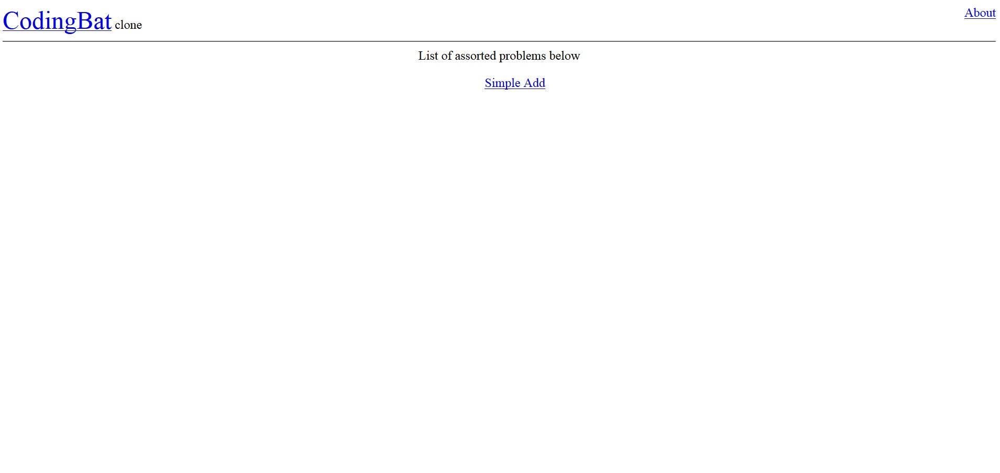
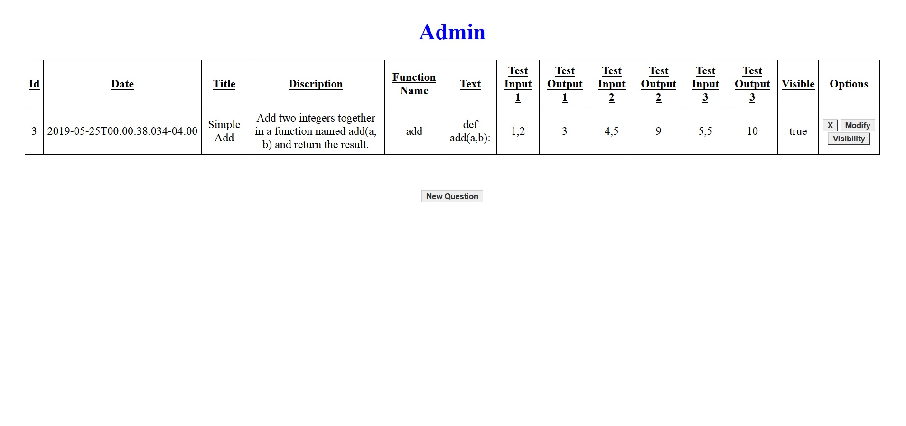
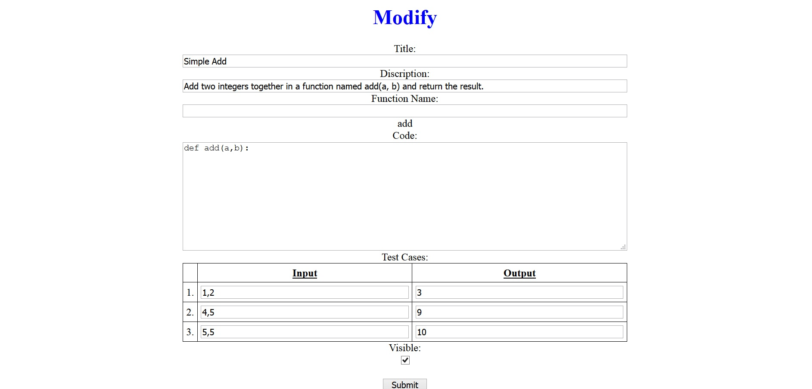
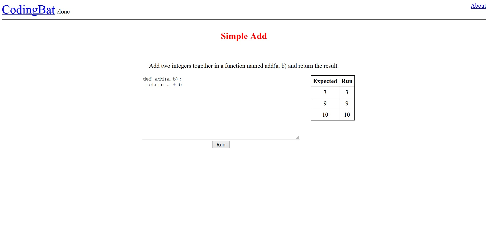

# codingbatclone
A very simple, no frills, clone of the popular website [codingbat](https://codingbat.com/) written in Java.
This will allow you to complete programming puzzles written in Python. 

## How To Run
```
mvn spring-boot:run -Dserver.port=5000
```

## Packages Used
1. Java Spring Boot
2. Thymeleaf
3. Spring JPA / Hibernate
4. Mysql
5. Tomcat

## Pages

### Index


### Admin


### Insert/Modify


### Question


### Run


### About


This project is meant for demonstration only, *do not* run on a WAN facing server. It has zero security and will run any code given to it by the user. I only created this to play-around with Java Spring.
