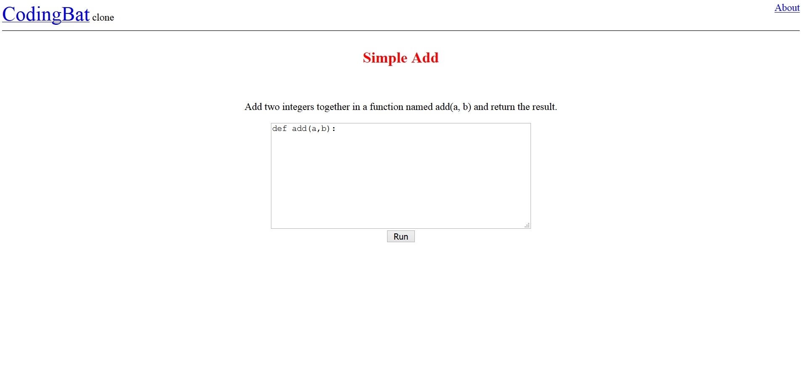

# codingbatclone
A very simple, no frills, clone of the popular website [codingbat](https://codingbat.com/) written in Java.
This will allow you to complete programming puzzles written in Python.

## Packages Used
1. Java Spring Boot
2. Thymeleaf
3. Spring JPA / Hibernate
4. Mysql
5. Tomcat

## Pages

### Index

### Admin

### Insert/Modify

### Question

### Run

### About

